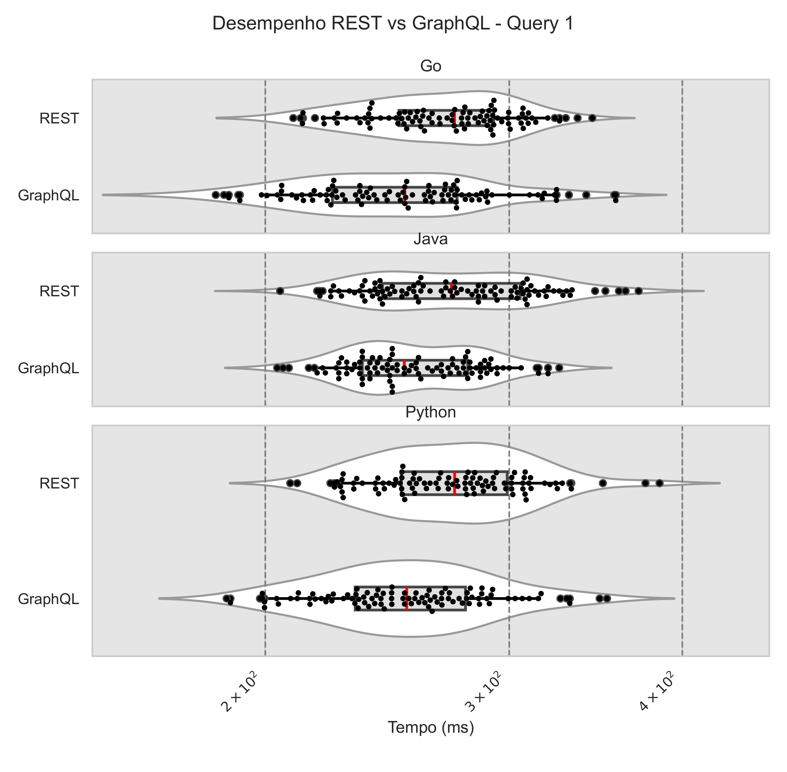
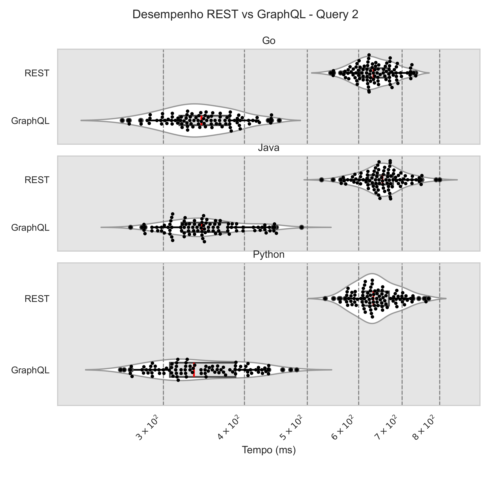
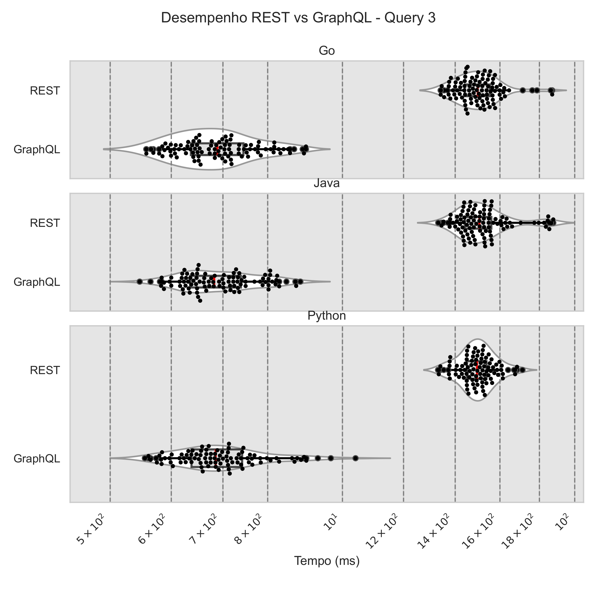

# Repositório TCC: Comparação entre REST e GraphQL  

Este é o repositório do meu **Trabalho de Conclusão de Curso (TCC)** focado na comparação entre as abordagens **REST** e **GraphQL**. O objetivo deste experimento é avaliar o **desempenho**, o **payload de request e response** e demonstrar como essas duas abordagens se comportam em diferentes linguagens e cenários. 

## Objetivo do Projeto  

O estudo busca entender as diferenças práticas entre REST e GraphQL em termos de:
- **Tempo de resposta e latência**  
- **Tamanho dos payloads** de request e response  
- **Facilidade de uso** em diferentes linguagens  
- **Comportamento e eficiência** em cada ambiente de execução  

Para isso, o mesmo conjunto de consultas foi implementado em **Java**, **Go** e **Python**, permitindo a comparação entre as três linguagens e a análise dos resultados em diferentes contextos.

---

## Estrutura do Repositório  

O repositório é organizado em três diretórios principais, cada um contendo uma aplicação que realiza as mesmas consultas usando as abordagens REST e GraphQL. Cada diretório tem seu próprio README com instruções específicas de uso.

### Diretórios do Projeto  

- **`java-tcc/`**  
  Contém a implementação do projeto em **Java**. A aplicação utiliza o Maven para gerenciamento de dependências e a API do GitHub como fonte de dados para as consultas REST e GraphQL.

- **`go-tcc/`**  
  Contém a implementação do projeto em **Go**. A aplicação usa o sistema nativo de módulos do Go para dependências e também realiza as consultas REST e GraphQL na API do GitHub.

- **`python-tcc/`**  
  Contém a implementação do projeto em **Python**. A aplicação realiza as mesmas consultas REST e GraphQL, integrando-se com a API do GitHub.

---

## Pré-requisitos  

Antes de navegar pelos diretórios específicos, verifique se você possui as ferramentas necessárias para cada linguagem. No geral, você precisará de:
- **Git** para clonar o repositório  
- **Java JDK 17+** e **Maven** para o projeto em Java  
- **Go 1.21+** para o projeto em Go  
- **Python 3.10+** e **pip** para o projeto em Python  

---

## Como Usar este Repositório  

1. **Clone o repositório**:  
   ```bash
   git clone https://github.com/nicolasdaldegan/tcc.git
   cd tcc
    ```  

2. **Escolha o projeto de interesse e siga as instruções no README correspondente**:  
   - Para **Java**, consulte o README em `java-tcc/` para instruções detalhadas sobre instalação e uso.  
   - Para **Go**, consulte o README em `go-tcc/` para obter informações específicas.  
   - Para **Python**, consulte o README em `python-tcc/` para as diretrizes necessárias.  

2. **Token de Acesso ao GitHub**:  
Todos os projetos exigem um token de acesso do GitHub para funcionar corretamente. Crie um token nas configurações da sua conta do GitHub (Developer settings > Personal access tokens) e adicione-o a um arquivo .env na raiz de cada projeto:

   ```bash
    TOKEN=SEU_TOKEN
    ```  

---

## Metodologia do Experimento

Cada projeto realiza a mesma consulta em REST e GraphQL utilizando a API do GitHub para medir e comparar:

- **Desempenho:** Tempo total de resposta para cada abordagem
- **Tamanho do Payload:** Verificação do tamanho dos dados enviados e recebidos
- **Latência e eficiência:** Como cada linguagem e abordagem lida com as consultas em diferentes condições

As consultas foram implementadas em três linguagens de programação – **Go**, **Java** e **Python** – em um ambiente controlado e isolado, utilizando uma instância AWS EC2. Cada tipo de consulta foi executado 100 vezes para obter resultados confiáveis e estatisticamente significativos. Além disso, gráficos de violin plot com box plot foram gerados para representar visualmente os resultados coletados.

---

## Resultados e Conclusões  

Com base nas medições realizadas, este projeto apresenta os seguintes principais resultados e análises comparativas:  

- **GraphQL se destacou em consultas complexas**: A abordagem foi mais eficiente ao consolidar dados de múltiplas fontes em uma única requisição, reduzindo o problema de under-fetching e eliminando conexões redundantes.  

- **REST demonstrou previsibilidade e simplicidade**: Em cenários de consultas simples, REST ofereceu maior estabilidade e consistência, sendo ideal para aplicações que não demandam alta flexibilidade.  

### Destaques dos Resultados  

1. **Desempenho em Consultas**  
   - **GraphQL foi até 54% mais rápido** em consultas complexas, graças à sua capacidade de consolidar dados em uma única chamada.  
   - Em consultas simples, o **REST apresentou desempenho competitivo**, com uma diferença menor em relação ao GraphQL.

   **Gráfico Comparativo de Tempos de Resposta (Query Simples)**  
     

   **Gráfico Comparativo de Tempos de Resposta (Query Média)**  
     

   **Gráfico Comparativo de Tempos de Resposta (Query Complexa)**  
     

2. **Tamanhos dos Payloads**  
   - O GraphQL retornou respostas significativamente menores, com uma redução de até **96% no tamanho das respostas**, eliminando dados desnecessários graças à personalização da consulta.  
   - Por outro lado, o REST apresentou tamanhos de payload fixos, o que pode ser eficiente para aplicações que demandam consistência nos dados.  

   **Tabela de Payloads de Request (em bytes)**  

   | Arquitetura | Query 1 | Query 2 | Query 3 |
   |-------------|---------|---------|---------|
   | REST        | 45      | 119     | 260     |
   | GraphQL     | 138     | 363     | 640     |

   **Tabela de Payloads de Response (em bytes)**  

   | Arquitetura | Query 1  | Query 2  | Query 3  |
   |-------------|----------|----------|----------|
   | REST        | 6550     | 20095    | 62824    |
   | GraphQL     | 187      | 2365     | 3496     |

### Conclusão  

Os resultados reforçam que **a escolha entre REST e GraphQL deve ser baseada nos requisitos específicos de cada aplicação**. Enquanto o REST é uma escolha confiável para sistemas legados e aplicações simples, o GraphQL se destaca em cenários que exigem flexibilidade e consultas altamente inter-relacionadas.  

Os dados e análises deste repositório fornecem uma base sólida para a decisão informada entre as duas arquiteturas, especialmente em projetos que envolvem diferentes níveis de complexidade e linguagens de programação.  

Para mais detalhes sobre a execução e os dados coletados, consulte os arquivos nos diretórios `java-tcc/`, `go-tcc/` e `python-tcc/`.
Os dados e análises deste repositório fornecem uma base sólida para a decisão informada entre as duas arquiteturas, especialmente em projetos que envolvem diferentes níveis de complexidade e linguagens de programação.  

Para mais detalhes sobre a execução e os dados coletados, consulte os arquivos nos diretórios `java-tcc/`, `go-tcc/` e `python-tcc/`.


